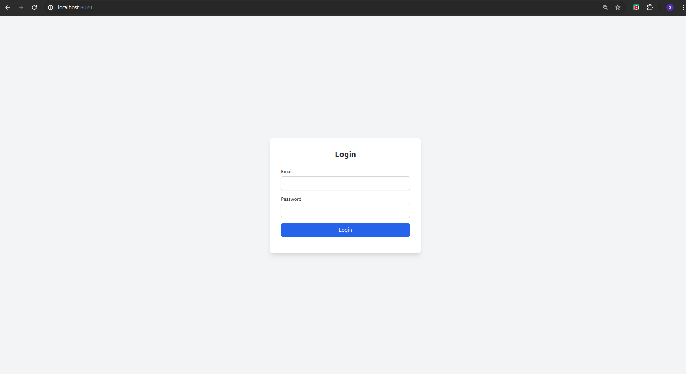
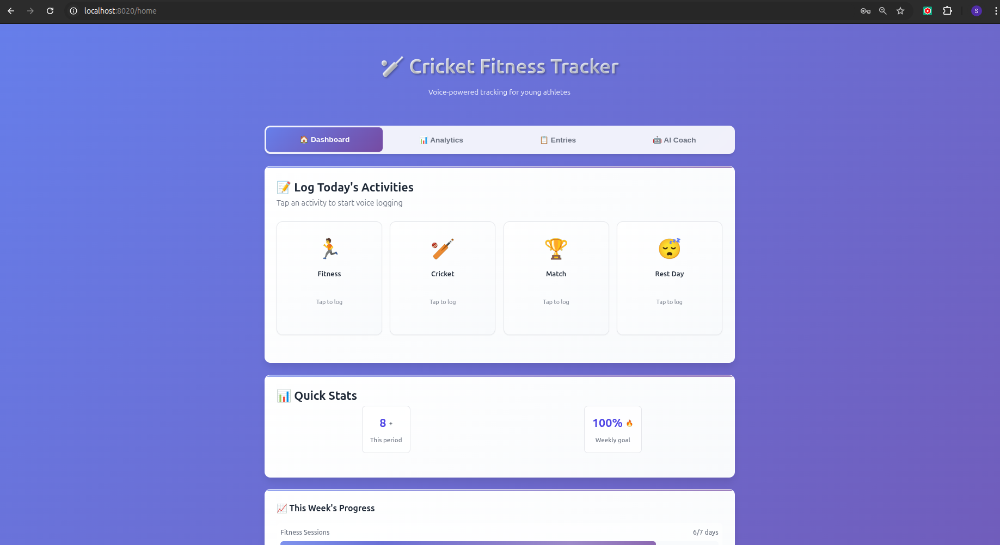
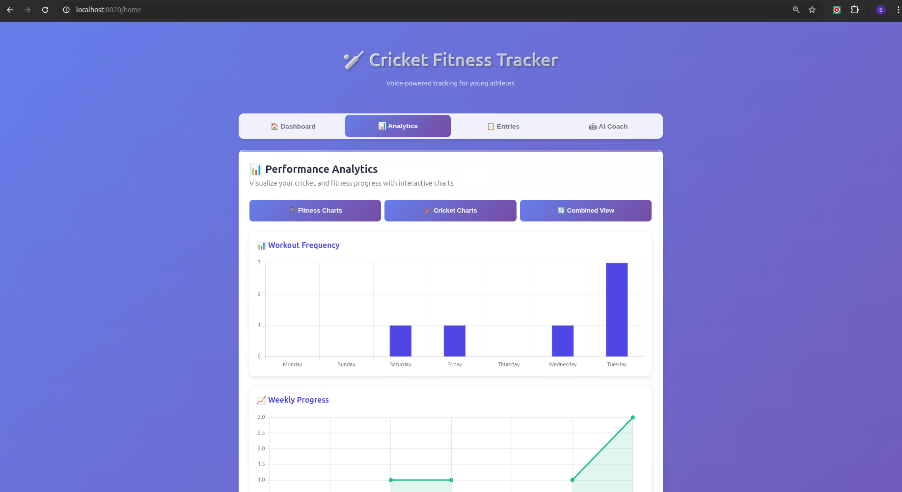
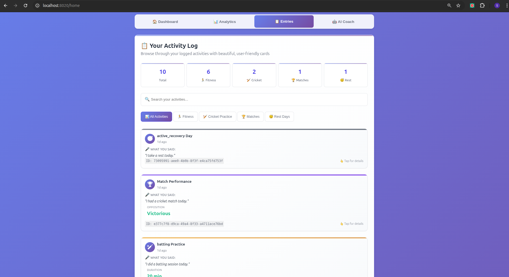
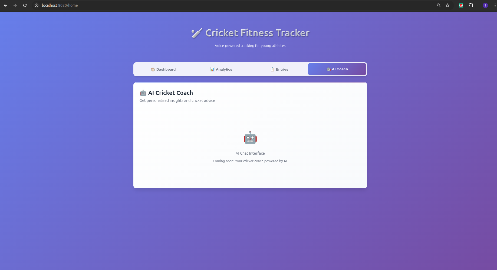
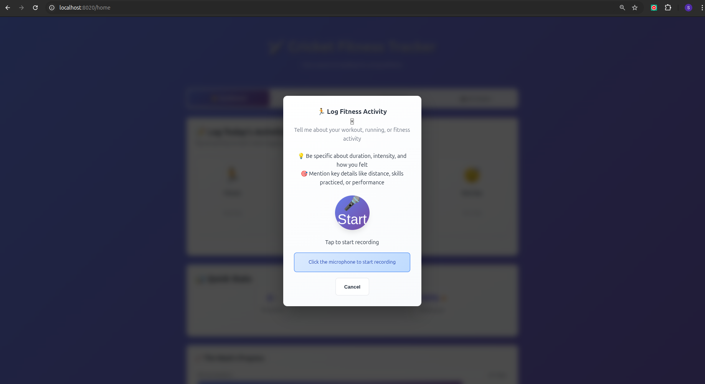
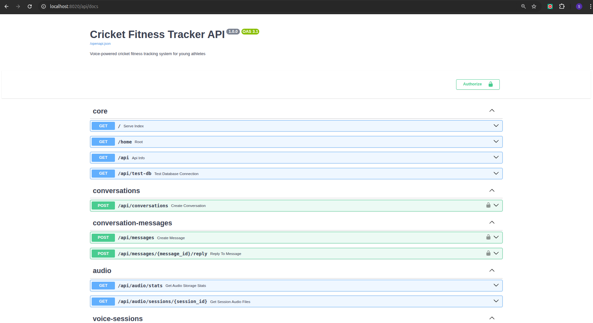

# 🏏 Cricket Fitness Tracker
**Latest 2025 Update**: Now featuring modern async patterns, enhanced voice processing, and production-ready architecture!

A comprehensive voice-powered fitness and cricket activity tracking system designed specifically for young athletes. Built with the latest 2025 FastAPI patterns, async SQLAlchemy, and modern AI voice processing.


## Technology Stack and Features

- ⚡ [**FastAPI**](https://fastapi.tiangolo.com) for the Python backend API.
    - [OpenAI](https://platform.openai.com/), for structure output
    - [Whisper](https://openai.com/index/whisper/), for voice to text
    - [Supabase](https://supabase.com/), supabase for authentication and database.
    - 🔍 [Pydantic](https://docs.pydantic.dev), used by FastAPI, for the data validation and settings management.
    - 💾 [PostgreSQL](https://www.postgresql.org) as the SQL database.

- ⚡ [**HTML**](https://developer.mozilla.org/en-US/docs/Web/HTML), [**CSS**](https://developer.mozilla.org/en-US/docs/Web/CSS), and [**JavaScript**](https://developer.mozilla.org/en-US/docs/Web/JavaScript) for a dynamic and lightweight frontend.

  - 🎨 Custom styling with pure CSS.
alt text
  - 🔄 Real-time updates via WebSockets and REST APIs using FastAPI.

  - 🔐 Authentication handled via [**Supabase**](https://supabase.com/).

  - 📊 Data visualizations using Chart.js.

- 🐋 [Docker Compose](https://www.docker.com) for development and production.
- 🚢 Deployment instructions using Docker Compose
- 🏭 CI (continuous integration) and CD (continuous deployment) based on GitHub Actions.


###  Login


### Dashboard
 

### Analytics


### Entries


### Ai coach  (comming soon)


### Log activities


- we can just open the mike and speak about our activities and  , there may some follow up questions  and just answer them and done your activities is saved 

### Interactive API Documentation



## ✨ Key Features

### 🎯 **Voice-First Interface**
- Real-time voice recording and processing
- AI-powered structured data extraction using OpenAI's latest structured outputs
- Support for multiple activity types with specialized prompts

### 🏏 **Cricket-Specific Tracking**
- **Fitness Activities**: Running, gym workouts, strength training
- **Cricket Coaching**: Practice sessions, drills, technique development
- **Match Performance**: Batting stats, wicket-keeping, bowling analysis
- **Rest & Recovery**: Sleep tracking, wellness monitoring

### 🚀 **Modern 2025 Architecture**
- **FastAPI**: Latest async patterns with modern lifespan management
- **SQLAlchemy 2.0**: Production-ready async database operations with connection pooling
- **OpenAI Integration**: Latest `client.beta.chat.completions.parse()` with Pydantic models
- **WebSocket Streaming**: Optimized real-time voice processing with connection management
- **Docker**: Production-ready containerization with health checks

# 🏃‍♂️ Quick Start Guide

This guide will help you set up and run the application using Docker.

## 🚧 Prerequisites

- [Docker](https://www.docker.com/get-started) and [Docker Compose](https://docs.docker.com/compose/)
- [OpenAI API key](https://platform.openai.com/account/api-keys)

---

## 1️⃣ Setup Environment

1. Copy the example environment file:

```bash
cp env.example .env
```

2. Open the `.env` file and fill in the required keys, such as:

```
OPENAI_API_KEY=your-openai-api-key-here
SUPABASE_URL=your-supabase-url
SUPABASE_KEY=your-supabase-service-role-key
```

---

## 2️⃣ Start the System

Run the following command to start everything with Docker Compose:

```bash
docker compose up -d
```

The app will be available at:

- 🔐 Login Interface: [http://localhost:8020](http://localhost:8020)
- 🏠 Home Interface: [http://localhost:8020/home](http://localhost:8020/home)
- 📚 API Docs: [http://localhost:8020/api/docs](http://localhost:8020/api/docs)
- ❤️ Health Check: [http://localhost:8020/health](http://localhost:8020/health)

---

## 🎙️ 3. Using the Voice Interface

1. Log in with your credentials.
2. You’ll be redirected to the `/home` page.
3. Choose an activity type:
    - Fitness
    - Cricket Coaching
    - Match
    - Rest Day
4. Click the **Record** button and speak about your activity.
5. The system will process your voice input and display structured data in real time.

Enjoy your voice-powered activity tracker! 🎧📊


# 🏗️ System Architecture Overview

we follow feature-based directory Architecture

This project is a modern voice-based cricket fitness tracker built with FastAPI, OpenAI, and async Python best practices. It helps players and coaches log, analyze, and track performance using voice input and structured data.

---

## 🔍 Key Technologies

- ⚙️ **Backend**: FastAPI with full async support (WebSockets, API, DB)
- 🧠 **AI Integration**: OpenAI structured outputs for voice transcription and activity analysis
- 📊 **Frontend**: HTML, CSS, JavaScript (minimal JS, real-time via WebSockets)
- 🗄️ **Database**: PostgreSQL with async SQLAlchemy 2.0 ORM
- 🐳 **DevOps**: Docker, Docker Compose, Health Checks, and Environment Configs

---

## 🧱 Architecture Highlights

### 📂 Database Layer
- Async SQLAlchemy 2.0 with connection pooling
- Optimized for high concurrency (20 connections, 30 overflow)
- Real-time health and connection monitoring

### 🔌 API Layer
- FastAPI lifespan management for clean startup/shutdown
- WebSocket-based real-time voice streaming
- Serves static HTML frontend with responsive design

### 🧠 AI Processing
- OpenAI’s latest structured output API (`parse()` support)
- Cricket-specific prompting for fitness and match analytics
- Robust fallback and error retry logic

---

## 🛠️ Local Development

```bash
# Install dependencies
poetry install

# Setup environment
cp env.example .env
# Edit the .env file with your credentials:
# OPENAI_API_KEY=...
# SUPABASE_URL=...
# SUPABASE_KEY=...
# DATABASE_URL=...

# Run the app
poetry run uvicorn app.main:app --reload --port 8010
```

---

## 🧪 Development Features

- Hot reload support via volume mounts
- Structured logging and detailed debug traces
- Interactive API docs at `/api/docs`

---

## 🐳 Docker Setup

### Development
```yaml
services:
  web:
    ports: ["8020:8010"]
    volumes: [".:/app"]
  postgres:
    ports: ["9432:5432"]
    volumes: ["postgres_data:/var/lib/postgresql/data"]
```

### Production
- Health checks for API and WebSocket
- Persistent storage for DB
- Environment-based scalable configs

---

## 🌟 2025 Improvements

- ✅ Full async processing from WebSocket to DB
- ✅ AI-powered structured outputs from voice input
- ✅ Optimized WebSocket and DB performance
- ✅ Real-time analytics for cricket fitness
- ✅ Comprehensive monitoring, logging, and error handling

---

## 🏏 Who Is It For?

This app is built for:

- 🧒 Young cricket players tracking fitness and performance
- 🧑‍🏫 Coaches reviewing player progress
- 🧑‍💻 Developers learning modern async Python + AI
- 🔊 Builders of voice-first, real-time web apps

---

Built with ❤️ for the cricket community